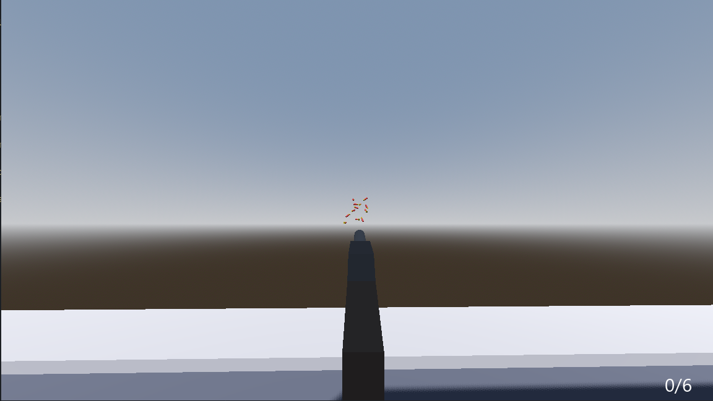

Today i was at school freakin obvouisly im a highschool student still so i as soon as i got home i went back to work on my epic game i spent time going from the shotgun firing in a cirlce in the last devlog which was unrealistc because it could shoot from 5 feet to the left or right of the gun now it comes out in a cone so its more realisitc!

Its kinda hard to tell so your gonna have to trust me on this one but as you can see in the same image i made a working bullet counter the uhhh techincal term, yeah! 

i also spent like 2 and a half hours freaking finding sounds it takes a while to find good gun sounds i did end up finding some satisfying ones for the shotgun aswell as the racking and loading of one 

my entire goal for this mini project was to make the gunplay as satisfying as possible with good sounds good reloading nice animations but i havent done the animations yet i want everytime you fire one of the guns for you to say wth thats so satysifing or just WOW thats cool EVERY TIME i felt that way with [generation zero](https://generationzero.com/en) its an amazing game a once through kinda game but nonetheless the way that the bullets sound when they ricehot of the machines metal and clatter to the floor it just tickles my brain you have to watch some gameplay

and the shotguns in that game are my whole inspiration for this project my favorite shotgun is not the best polymer one its the rusty dusty remington 12 guage that just absouletly is music to my ears so yeah thats day 3

